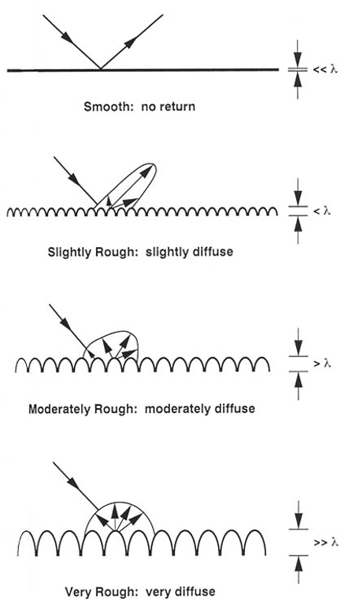
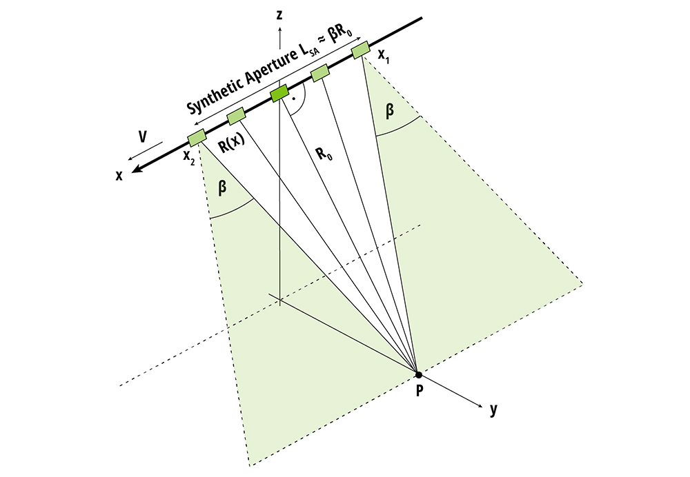
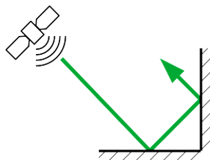

# SAR (Synthetic Aperture Radar)
O radar de abertura sintética (SAR) é um meio de geração de imagens onde um pulso de energia é emitido em diração ao solo. Após a interação esse, pulso é retroespalhado para o satélite. 
Quando esses pulsos incidem na superfície, podem ocorrer principalmente dois tipos de reflexão: especular ou difusa (também chamada de espalhamento)
### Reflexão Especular
A reflexão especular ocorre quando um pulso de micro-ondas incide em uma superfície lisa (em comparação com o comprimento de onda do radar). O pulso refletido possui o mesmo ângulo em relação à normal da superfície que o pulso incidente. Essa reflexão é análoga à lei da reflexão para a luz. Como o sinal é direcionado para longe do sensor (a menos que o sensor esteja na direção exata da reflexão especular), pouca ou nenhuma energia retroespalhada retorna ao satélite.

### Reflexão Difusa

A reflexão difusa, ou espalhamento, ocorre quando a superfície onde o pulso incide é rugosa (em comparação com o comprimento de onda do radar) ou complexa. Nesse caso, a energia do pulso é espalhada em múltiplas direções. Quanto mais rugosa ou complexa a superfície, maior a proporção da energia espalhada que retorna ao sensor.

Então, quando observamos uma imagem de radar de abertura sintética (SAR) de um local, o brilho dos pixels é determinado pela quantidade de energia de micro-ondas retroespalhada para o satélite. As regiões mais escuras são as mais lisas (como corpos d'água calmos), onde o feixe é refletido especularmente para longe do sensor, fazendo com que pouca energia retorne. Por outro lado, as regiões mais claras são as mais rugosas ou complexas (como áreas urbanas ou florestas), onde os pulsos são difusamente espalhados, e uma porção significativa deles 'volta' para o satélite, resultando em um sinal forte e pixels brilhantes.

## Resolução Espacial em Dados de Radar e o Conceito de Abertura Sintética

A resolução espacial é uma característica fundamental em dados de sensoriamento remoto, indicando o menor detalhe que pode ser distinguido em uma imagem. No caso dos dados de radar, a forma como essa resolução é alcançada tem um aspecto particularmente engenhoso, devido às limitações físicas dos equipamentos em órbita.

A resolução espacial dos dados de radar está diretamente relacionada à razão entre o comprimento de onda do sensor e o comprimento da antena do sensor. Isso significa que, para um dado comprimento de onda, quanto mais longa a antena, maior será a resolução espacial.

Por exemplo, um satélite com $\lambda$ de $5$ centímetros tentando atingir 10 metros teria que ter uma antena de $4.2km$, obviamente inviável. Foi para contornar essa limitação que cientistas e engenheiros desenvolveram uma solução engenhosa: a abertura sintética.

### Abertura Sintética

A ideia por trás da abertura sintética é a seguinte: em vez de usar uma única antena fisicamente longa, o sistema de radar em um satélite utiliza uma antena mais curta que se move ao longo de sua órbita. À medida que o satélite se desloca, ele realiza uma sequência de aquisições de pulsos de radar sobre o mesmo alvo na superfície terrestre.

Essas múltiplas aquisições, realizadas pela antena menor em diferentes posições ao longo de sua trajetória, são então combinadas e processadas. O resultado desse processamento é que elas simulam o efeito de uma antena muito maior. Essa "antena virtual" ou "sintética" é que permite a obtenção de dados com maior resolução espacial do que seria possível apenas com o tamanho físico da antena real.

Na imagem temos o seguinte:

* **Plataforma do Sensor (Linha Horizontal Superior e Retângulos Verdes):**
    * A **linha preta grossa** na parte superior representa a trajetória de voo do satélite ou aeronave onde o sensor SAR está embarcado. É o eixo 'x' do sistema de coordenadas do sensor.
    * Os pequenos **retângulos verdes** representam a antena física real do radar em diferentes posições ao longo dessa trajetória.
    * A seta **'V'** indica a velocidade da plataforma, e a seta **'x'** mostra a direção de movimento.

* **Ponto de Alvo (P):**
    * O **ponto preto 'P'** na parte inferior direita da imagem é o alvo na superfície da Terra que está sendo imageado. Este é o ponto de interesse sobre o qual o radar está coletando dados.

* **Feixe do Radar (Área Verde Sombreada):**
    * A **área verde sombreada** representa o feixe de micro-ondas que a antena real emite e recebe. Observe que este feixe se abre em forma de leque, iluminando uma área da superfície.
    * O ângulo $\beta$ indica o ângulo do feixe de radar em relação à linha de visão.

* **Distância Inclinada ($R_0$ e $R(x)$):**
    * $R_0$ é a menor **distância inclinada (slant range)** do sensor ao ponto P, que ocorre quando o sensor está diretamente sobre o ponto P no eixo do feixe (menor distância no plano range-Doppler).
    * $R(x)$ é a distância inclinada entre a antena em uma posição arbitrária 'x' e o ponto alvo 'P'.

* **Abertura Sintética ($L_{SA}$ ou $βR_0$):**
    * A **linha tracejada mais longa** sobre a trajetória do sensor, rotulada "Synthetic Aperture $L_{SA} = βR_0$", é a abertura sintética.
    * Ela **não é uma antena física**. Em vez disso, representa o comprimento efetivo da antena que é simulado combinando os dados coletados pela antena física real enquanto ela se move ao longo dessa distância.
    * Os pontos $x_1$ e $x_2$ na trajetória do sensor marcam o início e o fim da região onde o ponto P é "iluminado" pelo feixe do radar e onde os dados são coletados para formar a abertura sintética.

* **Sistema de Coordenadas:**
    * Os eixos **x, y e z** representam o sistema de coordenadas.
    * **'x'** é a direção de voo da plataforma (azimute).
    * **'y'** é a direção perpendicular à de voo no plano do solo (range).
    * **'z'** é a direção vertical (altitude).

À medida que o satélite se desloca de $x_2$ para $x_1$, a antena real emite e recebe pulsos de micro-ondas, observando o ponto P de diferentes ângulos ao longo dessa trajetória. Devido à natureza coerente do SAR, o sistema registra não apenas a intensidade do sinal retornado de P em cada posição, mas também a fase desse sinal, que varia ligeiramente com as pequenas mudanças na distância inclinada e no ângulo de visão à medida que o satélite se move. Ao longo do comprimento da abertura sintética ($L_{SA}$), o radar coleta uma série de sinais retroespalhados do ponto P, que são processados digitalmente como se tivessem sido recebidos por uma única antena gigante que se estende por todo o comprimento $L_{SA}$. Esse processamento permite ao SAR alcançar uma resolução espacial significativamente mais alta na direção de voo (azimute) do que seria possível com o tamanho físico da antena real, sendo a resolução azimutal inversamente proporcional ao comprimento da abertura sintética, de modo que uma abertura sintética mais longa resulta em uma resolução mais fina.

## Frequências e Comprimento de ondas

Os satélites coletam dados utilizando ondas em frequências e comprimentos diferentes, sendo que cada uma dessas frequências representam uma **banda** diferente, como é possível ver na tabela abaixo.

| Banda | Frequência   | Comprimento de Onda | Aplicação Típica                                          |
|-------|--------------|---------------------|----------------------------------------------------------|
| Ka    | 27-40 GHz    | 1,1-0,8 cm          | Pouco utilizado                                          |
| K     | 18-27 GHz    | 1,7-1,1 cm          | Pouco utilizado                                          |
| Ku    | 12-18 GHz    | 2,4-1,7 cm          | Pouco utilizado                                          |
| X     | 8-12 GHz     | 3,8-2,4 cm          | Alta resolução SAR (monitoramento urbano; gelo e neve, pouca penetração em vegetação; rápida perda de coerência em áreas vegetadas) |
| C     | 4-8 GHz      | 7,5-3,8 cm          | SAR versátil (mapeamento global, detecção de mudanças, monitoramento de áreas com penetração baixa a moderada, maior coerência; gelo, oceano, navegação marítima) |
| S     | 2-4 GHz      | 15-7,5 cm           | Uso crescente para observação terrestre baseada em SAR e monitoramento agrícola (NISAR levará um canal S-banda; expande aplicações de C-banda para maior densidade de vegetação) |
| L     | 1-2 GHz      | 30-15 cm            | Resolução média SAR (monitoramento geofísico, mapeamento de biomassa e vegetação, alta penetração, SAR interferométrico [InSAR]) |
| P     | 0,3-1 GHz    | 100-30 cm           | Biomassa, mapeamento de vegetação e avaliação. Banda SAR experimental. |

Cada banda tem uma penetração maior, sendo a banda P a que consegue capturar dados de maneira mais profunda.

A imagem acima ilustra a interação de diferentes bandas de radar (X, C, L e P) com a vegetação, destacando a penetração das ondas de radar em função de seus comprimentos de onda. A banda X, com comprimento de onda de 3 cm, apresenta penetração mínima, sendo refletida principalmente pela superfície da vegetação, o que a torna adequada para monitoramento de alta resolução em áreas urbanas, gelo e neve. A banda C, com comprimento de onda de 6 cm, oferece penetração moderada, alcançando parcialmente a vegetação, e é amplamente utilizada para mapeamento global, monitoramento de gelo, oceano e navegação marítima. A banda L, com comprimento de onda de 24 cm, proporciona penetração significativa, atingindo profundamente a vegetação, sendo ideal para monitoramento geofísico, mapeamento de biomassa e SAR interferométrico (InSAR). Por fim, a banda P, com comprimento de onda de 65 cm, exibe penetração muito alta, revelando as estruturas internas da vegetação, e é aplicada em mapeamento de biomassa, vegetação e avaliação, sendo considerada uma banda experimental.
## Polarização

A polarização descreve a orientação do plano em que uma onda eletromagnética transmitida realiza suas oscilações. Em sistemas de radar, essa propriedade pode ser gerenciada de maneira precisa, permitindo que os sensores capturem sinais em diversas configurações de polarização tanto durante a transmissão quanto na recepção. Embora a orientação da polarização possa teoricamente assumir qualquer ângulo, os sensores de radar de abertura sintética (SAR) geralmente empregam polarizações lineares como padrão. Nesse contexto, a polarização horizontal é representada pela letra H (horizontal), enquanto a polarização vertical é indicada pela letra V (vertical), oferecendo uma base fundamental para a análise dos dados coletados. A polarização também pode ser entendida como a direção de propagação da onda eletromagnética: uma onda horizontal oscila em um plano paralelo à superfície imageda, enquanto uma onda vertical oscila em um plano perpendicular a essa superfície.

Uma das principais vantagens dos sensores de radar reside na possibilidade de controle detalhado da polarização em ambas as etapas do processo: transmissão e recepção. Por exemplo, um sinal transmitido com polarização vertical (V) e recebido com polarização horizontal (H) é identificado pela notação VH. Da mesma forma, um sinal transmitido e recebido com polarização horizontal (H) é designado como HH. Outras combinações, como VV (transmissão e recepção em polarização vertical) ou HV (transmissão horizontal e recepção vertical), também são possíveis e amplamente utilizadas. Essa flexibilidade na manipulação da polarização permite aos sistemas SAR extrair informações ricas e específicas sobre as características das superfícies e objetos observados, baseando-se em diferentes mecanismos de espalhamento das ondas eletromagnéticas. Diferentes sensores SAR possuem capacidades variadas de polarização. Sensores de polarização única (single-pol) emitem um sinal em uma única polarização e só conseguem medir retornos na mesma polarização (VV ou HH). Sensores de polarização dupla (dual-pol) emitem um sinal em uma polarização, mas podem medir retornos tanto na mesma polarização (co-pol: VV ou HH) quanto na polarização oposta (cross-pol: VH ou HV). Alguns sistemas SAR avançados podem transmitir sinais com polarização horizontal ou vertical e receber retornos em ambas as polarizações, oferecendo capacidades completas de polarização quádrupla (quad-pol: VV, VH, HV, HH).

Os dados obtidos a partir dessas configurações de polarização fornecem insights valiosos sobre a estrutura da superfície imageda, sendo interpretados por meio de três tipos principais de espalhamento: superfície áspera, volume e duplo rebote. Cada tipo de espalhamento reflete interações distintas entre as ondas de radar e os elementos do ambiente.

- **Espalhamento por superfície áspera** ocorre quando as ondas interagem com terrenos irregulares, como solo exposto, rochas ou corpos d'água. Esse tipo de espalhamento é particularmente sensível ao padrão VV, onde tanto a transmissão quanto a recepção ocorrem em polarização vertical. A razão para essa sensibilidade reside no fato de que superfícies ásperas tendem a refletir as ondas de maneira mais consistente na mesma orientação em que foram emitidas, preservando a polarização original e permitindo uma análise precisa de texturas e rugosidades.

- **Espalhamento por volume** é observado em ambientes complexos, como o dossel de florestas, onde as ondas interagem com folhas, galhos e outros elementos tridimensionais. Esse mecanismo é mais evidente em dados de polarização cruzada, como VH ou HV, devido à alteração da orientação das ondas à medida que elas são espalhadas em múltiplas direções pela vegetação densa. Essa característica torna a polarização cruzada essencial para mapear a estrutura e a densidade da biomassa, oferecendo informações cruciais para estudos ecológicos e de monitoramento ambiental.

- **Espalhamento por duplo rebote** resulta de interações em que as ondas são refletidas duas vezes antes de retornar ao sensor, como ocorre entre troncos de árvores e o solo ou entre paredes de edifícios e o terreno. Esse tipo de espalhamento é mais pronunciado em sinais polarizados HH, onde a transmissão e a recepção ocorrem em polarização horizontal. A sensibilidade ao HH decorre da geometria dessas reflexões, que frequentemente preserva a polarização horizontal original, sendo particularmente útil para identificar estruturas verticais, como edificações ou vegetação inundada. 

A capacidade de analisar esses diferentes tipos de espalhamento por meio de configurações de polarização variadas enriquece significativamente as aplicações dos radares SAR. Essa tecnologia é amplamente empregada em áreas como agricultura, onde ajuda a monitorar o crescimento de culturas; em geofísica, para avaliar mudanças no terreno; e em gerenciamento de desastres, para mapear áreas afetadas por inundações ou desmatamento. Além disso, a integração de dados polarimétricos permite diferenciar materiais e texturas com maior precisão, contribuindo para avanços em pesquisas científicas e planejamento urbano. A polarimetria, um campo emergente no processamento de SAR, utiliza essas técnicas para uma variedade de aplicações, incluindo a medição de propriedades da vegetação e a análise de mudanças temporais na cobertura vegetal. Outras áreas beneficiadas incluem oceanografia, geologia e resposta a desastres, onde a polarimetria proporciona dados detalhados para monitoramento e análise ambiental. Assim, a manipulação estratégica da polarização constitui uma ferramenta poderosa para extrair informações detalhadas e confiáveis do ambiente observado.

---
Referências

https://www.earthdata.nasa.gov/learn/earth-observation-data-basics/sar
https://www.capellaspace.com/blog/sar-101-an-introduction-to-synthetic-aperture-radar
https://hyp3-docs.asf.alaska.edu/guides/introduction_to_sar/
https://www.if.ufrj.br/~marta/cederj/otica/02-5.pdf
https://brasilescola.uol.com.br/fisica/reflexao-especular-difusa.htm
https://www.electricity-magnetism.org/pt-br/polarizacao-definicao-e-tipos-linear-circular-e-eliptico/
